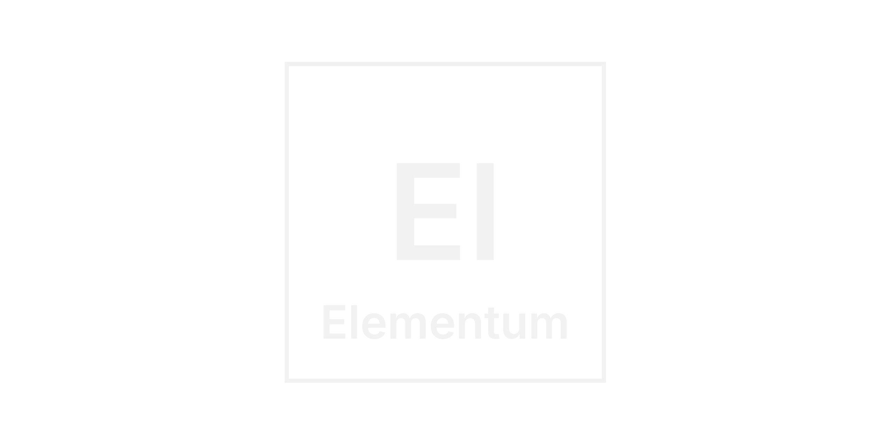

<br />
<div align="center">
  

  <h1 align="center">Elementum</h1>

  
  <a href="https://github.com/itsanas-dev/elementum/issues"></a>
  
  <p style="margin-top: 1rem;">
    An interactive, fast and lightweight Periodic Table for your needs.
  </p>

  <a target="_blank" href="https://elementumapp.vercel.app"><strong>Visit the website</strong></a>
</div>

<!-- GETTING STARTED -->
## Getting Started

This is an example of how you may give instructions on setting up your project locally.
To get a local copy up and running follow these simple example steps.

### Quick start
Git clone the repository and install the dependencies

```sh
npm install
```

Then, run the local website using npm dev

```sh
npm run dev
```

Or if you want to build the project

```sh
npm run build
npm run preview
```

<!-- CONTRIBUTING -->
## Contributing

Any contribution to features and issues you make are **greatly appreciated**.

If you have a suggestion that you would like to make or you have encountered a bug, please fork the repo and create a pull request or issue thread.
Don't forget to give the project a star! Thanks again!

<!-- LICENSE -->
## License

Distributed under the [GNU GPL-v3 License](https://www.gnu.org/licenses/gpl-3.0.en.html#license-text). See [`LICENSE.txt`](https://github.com/itsanas-dev/elementum/blob/master/LICENSE) for more information.

## Acknowledgments

* [Periodic Table JSON](https://github.com/Bowserinator/Periodic-Table-JSON) - For the periodic table data
* [Img Shields](https://shields.io) - For the shields
* [Lucide icons](https://lucide.dev/) - For the icon pack used on the website.